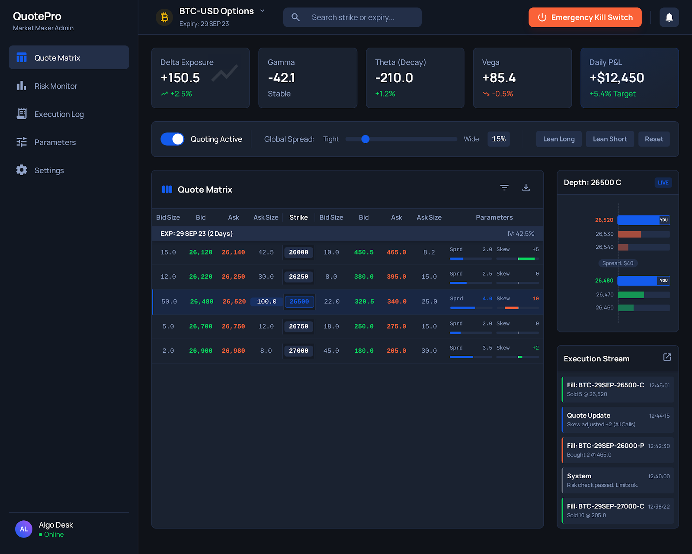
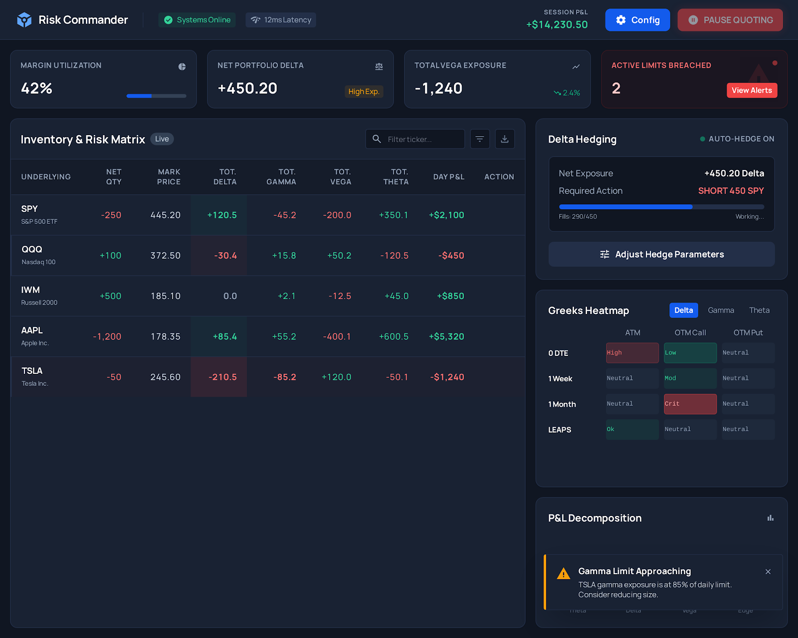
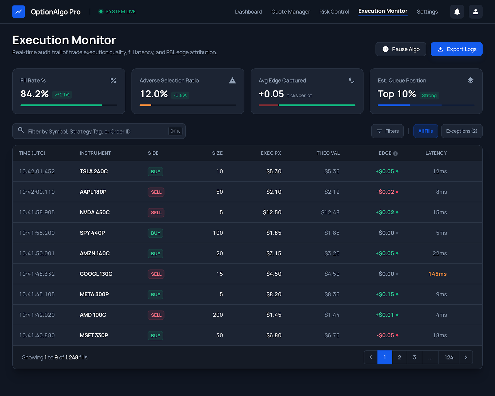
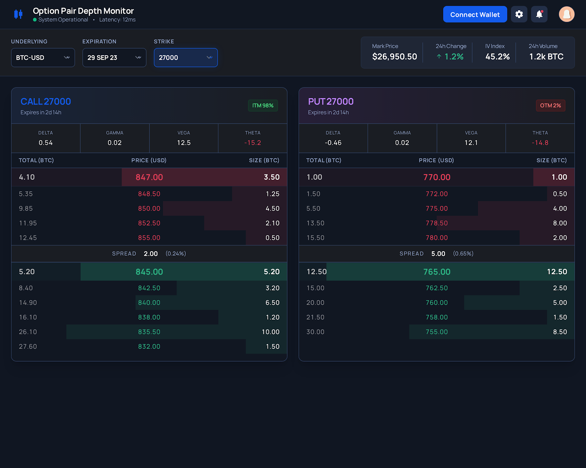
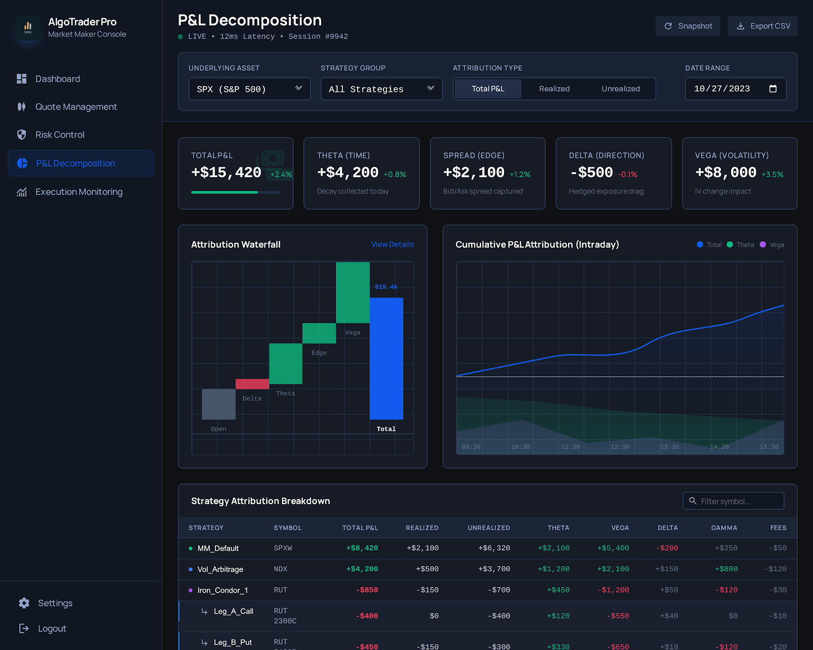

# Option Chain OrderBook Frontend

A modern SvelteKit-based control console for options market making operations.

## Screenshots

### Quote Matrix



### Risk Commander



### Execution Monitor



### Option Pair Depth Monitor



### Algo Trader Pro



## Features

- **Operational Controls** (`/controls`) - Master quoting switch, global parameters, instrument toggles
- **Quote Matrix** (`/quotes`) - Real-time bid/ask display with spread and skew controls
- **Order Book Depth** (`/depth`) - Call/Put pair order book depth from point-in-time backend snapshots (per-option Greeks and IV are not yet provided by the backend and render as `—`)
- **Risk Commander** (`/risk`) - Portfolio Greeks, inventory management, delta hedging
- **Execution Monitor** (`/executions`) - Trade audit trail, fill quality metrics
- **P&L Decomposition** (`/pnl`) - Attribution breakdown by theta, delta, vega, edge

## Tech Stack

- **Framework**: SvelteKit 2.x with Svelte 5
- **Styling**: TailwindCSS with custom dark theme
- **Icons**: Material Symbols Outlined
- **Font**: Manrope

## Getting Started

### Prerequisites

- Node.js 18+
- npm or pnpm

### Installation

```bash
npm install
```

### Development

```bash
npm run dev
```

The app will be available at `http://localhost:5173`.

### Build

```bash
npm run build
npm run preview
```

## Project Structure

```
src/
├── lib/
│   ├── api/
│   │   ├── client.ts       # REST API client
│   │   └── websocket.ts    # WebSocket client for real-time updates
│   ├── components/
│   │   ├── Header.svelte   # Top navigation bar
│   │   └── Sidebar.svelte  # Side navigation
│   └── stores/
│       ├── controls.ts     # Quoting controls state
│       └── system.ts       # System status state
├── routes/
│   ├── +layout.svelte      # Main layout
│   ├── +page.svelte        # Root redirect
│   ├── controls/           # Operational Controls
│   ├── quotes/             # Quote Matrix
│   ├── depth/              # Order Book Depth Monitor
│   ├── risk/               # Risk Commander
│   ├── executions/         # Execution Monitor
│   └── pnl/                # P&L Decomposition
├── app.css                 # Global styles
├── app.d.ts                # TypeScript declarations
└── app.html                # HTML template
```

## Backend API

The frontend expects a REST API at `/api/v1` with the following endpoints:

- `GET /health` - Health check (served unprefixed, not under `/api/v1`)
- `GET /stats` - Global statistics
- `GET /underlyings` - List underlyings
- `GET /underlyings/:symbol/expirations` - List expirations
- `GET /underlyings/:symbol/expirations/:exp/strikes` - List strikes
- `GET /underlyings/:symbol/expirations/:exp/strikes/:strike/options/:style/snapshot?depth=N` - Per-level order-book snapshot (prices in integer cents)
- `GET /prices/:symbol` - Latest underlying price (dollars)
- `GET /controls` - Current quoting controls
- `POST /controls/kill-switch` - Emergency kill switch
- `POST /controls/enable` - Re-enable quoting
- `POST /controls/parameters` - Update quoting parameters
- `GET /controls/instruments` - List instruments with quoting status
- `POST /controls/instrument/:symbol/toggle` - Toggle instrument quoting

## Configuration

The Vite dev server proxies `/api` requests to `http://localhost:8080` by default. Update `vite.config.ts` to change the backend URL.

## Design System

### Colors

| Token             | Value     | Usage                       |
| ----------------- | --------- | --------------------------- |
| `primary`         | `#135bec` | Primary actions, highlights |
| `background-dark` | `#101622` | Main background             |
| `surface-dark`    | `#1a2230` | Card backgrounds            |
| `border-dark`     | `#232f48` | Borders                     |
| `text-muted`      | `#92a4c9` | Secondary text              |
| `success`         | `#0bda5e` | Positive values             |
| `danger`          | `#fa6238` | Negative values, alerts     |
| `warning`         | `#f59e0b` | Warnings                    |

## License

MIT
